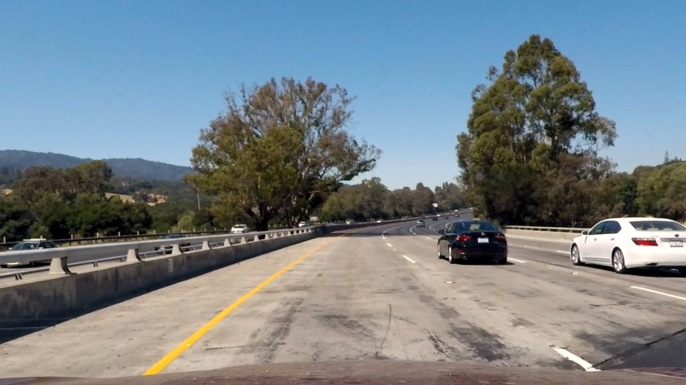
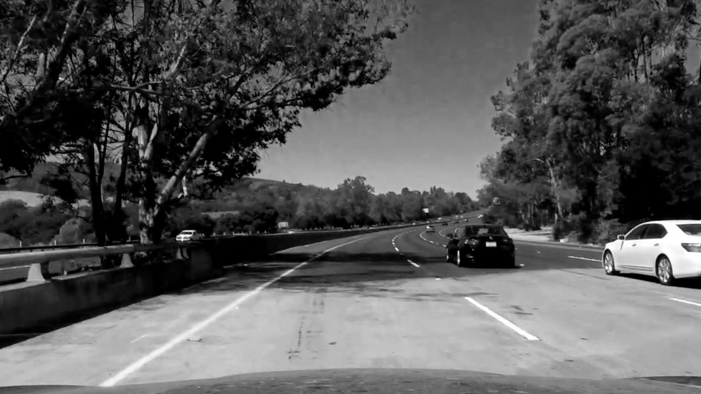

[//]: # (Image References)

[image1]: ./examples/undistort_output.png "Undistorted"
[image2]: ./test_images/test1.jpg "Road Transformed"
[image3]: ./examples/binary_combo_example.jpg "Binary Example"
[image4]: ./examples/warped_straight_lines.jpg "Warp Example"
[image5]: ./examples/color_fit_lines.jpg "Fit Visual"
[image6]: ./examples/example_output.jpg "Output"
[video1]: ./project_video.mp4 "Video"

<!-- 


output_images/S_channel_1.jpg
output_images/S_channel_2.jpg
output_images/w_y_hls_1.jpg
output_images/w_y_hls_2.jpg

output_images/sobel_origin.jpg
output_images/sobel_abs_x.jpg
output_images/sobel_abs_y.jpg
output_images/sobel_mag.jpg
output_images/sobel_dir.jpg
output_images/sobel_combin.jpg

output_images/color_grad_combin.jpg
output_images/sobel_combin.jpg
output_images/aoi.jpg
output_images/pers_trans_org.jpg
output_images/pers_trans_curv.jpg
output_images/pers_trans_str_line.jpg

output_images/all_thresh_org.jpg
output_images/all_thresh_binary.jpg

output_images/all_thresh_org.jpg
output_images/all_thresh_binary_pers_trans.jpg

output_images/histogram_1.jpg
output_images/histogram_2.jpg

output_images/detect_lane_pix_and_fit_curv
output_images/detect_lane_pix_and_fit_straight

output_images/det_curv_lane_org.jpg
output_images/det_curv_lane_draw_laneline.jpg

./output_images/project_video_frame_2.0.jpg
./output_images/project_video_frame_14.0.jpg
./output_images/project_video_frame_21.0.jpg
./output_images/project_video_frame_24.0.jpg
./output_images/project_video_frame_29.0.jpg
./output_images/project_video_frame_39.0.jpg
./output_images/project_video_frame_41.0.jpg
./output_images/project_video_frame_45.0.jpg

./output_images/project_video_frame_out_2.0.jpg
./output_images/project_video_frame_out_14.0.jpg
./output_images/project_video_frame_out_21.0.jpg
./output_images/project_video_frame_out_24.0.jpg
./output_images/project_video_frame_out_29.0.jpg
./output_images/project_video_frame_out_39.0.jpg
./output_images/project_video_frame_out_41.0.jpg
./output_images/project_video_frame_out_45.0.jpg
 -->

<!-- <table>
    <tr>
        <td>
            
        </td>
        <td>
            
        </td>
    </tr>
</table> -->

<!--    -->

 
# **Advanced Lane Finding Project**


---

The goals / steps of this project is to build a Lane Finding Pipeline as the following:

* Compute the camera calibration matrix and distortion coefficients given a set of chessboard images.
* Apply a distortion correction to raw images.
* Use color transforms, gradients, etc., to create a thresholded binary image.
* Apply a perspective transform to rectify binary image ("birds-eye view").
* Detect lane pixels and fit to find the lane boundary.
* Determine the curvature of the lane and vehicle position with respect to center.
* Warp the detected lane boundaries back onto the original image.
* Output visual display of the lane boundaries and numerical estimation of lane curvature and vehicle position.


---

### Camera Calibration

#### 1. The below description is how I computed the camera matrix and distortion coefficients with an example of a distortion corrected calibration image.

```python
# prepare object points, like (0,0,0), (1,0,0), (2,0,0) ....,(6,5,0)
objp = np.zeros((6*8,3), np.float32)
objp[:,:2] = np.mgrid[0:8, 0:6].T.reshape(-1,2) #that will shape coordinate back to two colomns x and y
# Arrays to store object points and image points from all the images.
objpoints = [] # 3d points in real world space
imgpoints = [] # 2d points in image plane.
# Step through the list and search for chessboard corners
for idx, fname in enumerate(images): #idx start from 0 to len(images)
    img = cv2.imread(fname)
    gray = cv2.cvtColor(img, cv2.COLOR_BGR2GRAY)
    # Find the chessboard corners
    ret, corners = cv2.findChessboardCorners(gray, (8,6), None)
    # If found, add object points, image points
    if ret == True:
        objpoints.append(objp)
        imgpoints.append(corners)
        # Draw and display the corners
        cv2.drawChessboardCorners(img, (8,6), corners, ret)
```

I started by preparing "object points", which will be the (x, y, z) coordinates of the chessboard corners in the world. Here I am assuming the chessboard is fixed on the (x, y) plane at z=0, such that the object points are the same for each calibration image.  Thus, `objp` is just a replicated array of coordinates, and `objpoints` will be appended with a copy of it every time I successfully detect all chessboard corners in a test image.  `imgpoints` will be appended with the (x, y) pixel position of each of the corners in the image plane with each successful chessboard detection.  

I then used the output `objpoints` and `imgpoints` to compute the camera calibration and distortion coefficients using the `cv2.calibrateCamera()` function.  I applied this distortion correction to the test image using the `cv2.undistort()` function and obtained this result: 


|  
|:--:| 
|*Original Image  _________________________    Undistoted Image*|

<!--   -->
<!-- *hello* -->


<!-- ![alt text][image1] -->

### Pipeline (single images)

#### 1. Distortion-corrected image.

To demonstrate this step, I will describe how I apply the distortion correction to one of the test images like this one:

|  
|:--:| 
|*Original test image  _________________________    Undistoted test image*|

<!-- ![alt text][image2] -->

So, when we apply the distortion correction on out test images the result will be as below:

|  
|:--:| 
|*Original image  _________________________    Undistoted image*|


#### 2. Color transforms, gradients or other methods to create a thresholded binary image. 

I used a combination of color and gradient thresholds to generate a binary image (thresholding steps at lines # through # in `P2.py`).  
A color space is a specific organization of colors; color spaces provide a way to categorize colors and represent them in digital images.

RGB is red-green-blue color space. You can think of this as a 3D space, in this case a cube, where any color can be represented by a 3D coordinate of R, G, and B values. For example, white has the coordinate (255, 255, 255), which has the maximum value for red, green, and blue.

I splitted up the image to three channels as below:

```python
R = undistorted_test_image[:,:,0]
G = undistorted_test_image[:,:,1]
B = undistorted_test_image[:,:,2]
```

Here's an example of my output for this step.

|  
|:--:| 
|*R-Channel____________________G-Channel______________________B-Channel*|

Then I repeated the smae for HLS channels

```python
hls = cv2.cvtColor(undistorted_test_image, cv2.COLOR_RGB2HLS)
H_channel = hls[:,:,0]
L_channel = hls[:,:,1]
S_channel = hls[:,:,2]
```
Here's an example of my output for this step.

|  
|:--:| 
|*H-Channel____________________L-Channel______________________S-Channel*|

From these examples, you can see that the R channel does a reasonable job of highlighting the lines and the **S channel** is probably the best bet to picks up the lines well.

To identify White and Yellow Color in the Images we need to apply the below code

```python
def get_y_w_hls_images(img):
    
    hls_image =  cv2.cvtColor(img, cv2.COLOR_RGB2HLS)
    # White isolated from HLS components
    w_hls = np.zeros_like(hls_image[:,:,0])
    w_hls[((hls_image[:,:,0] >= 0)   & (hls_image[:,:,0] <= 255))
        & ((hls_image[:,:,1] >= 210) & (hls_image[:,:,1] <= 255))
        & ((hls_image[:,:,2] >= 0)   & (hls_image[:,:,2] <= 255))] = 1
    # Yellow isolated from HLS components
    y_hls = np.zeros_like(hls_image[:,:,0])
     y_hls[((hls_image[:,:,0] >= 20)  & (hls_image[:,:,0] <= 30))
        & ((hls_image[:,:,1] >= 20)  & (hls_image[:,:,1] <= 200))
        & ((hls_image[:,:,2] >= 90) & (hls_image[:,:,2] <= 255))] = 1
    # OR yellow with white
    hls_w_y = np.zeros_like(hls_image[:,:,0])
    hls_w_y[(w_hls == 1) | (y_hls == 1) ] = 1
```

|  
|:--:| 
|*Undistorted Image  _________________________ W_Y Color Thresholded Image*|


#### Applying Sobel Thresholding
----
**Calculate the absolute threshold value for x and y**

Calculate the derivative in the xx and yy direction (the 1, 0 at the end denotes xx direction) and (the 0, 1 at the end denotes yy direction).

Pass in img and set the parameter orient as 'x' or 'y' to take either the xx or yy gradient. Set thresh_min, and thresh_max to specify the range to select for binary output. We can use exclusive (<, >) or inclusive (<=, >=) thresholding.
```python
# Apply x or y gradient with the OpenCV Sobel() function
    # and take the absolute value
    if orient == 'x':
        abs_sobel = np.absolute(cv2.Sobel(gray_img, cv2.CV_64F, 1, 0, ksize = sobel_kernel))
    if orient == 'y':
        abs_sobel = np.absolute(cv2.Sobel(gray_img, cv2.CV_64F, 0, 1, ksize = sobel_kernel))
# Rescale back to 8 bit integer
    scaled_sobel = np.uint8(255*abs_sobel/np.max(abs_sobel))
    # Create a copy and apply the threshold
    binary_output = np.zeros_like(scaled_sobel)
    # Here I'm using inclusive (>=, <=) thresholds, but exclusive is ok too
binary_output[(scaled_sobel >= thresh_min) & (scaled_sobel <= thresh_max)] = 1
```
***NOTE:*** YOur output should be an array of the same size as the input image. The output array elements should be 1 where gradients were in the threshold range, and 0 everywhere else.
Here's an example of my output for this step:

|   
|:--:|
|*Original image____________________Abs_Sobel_X______________________Abs_Sobel_Y*|


**Magnitude and Direction of the Gradient**
The magnitude, direction, or absolute value, of the gradient is just the square root of the squares of the individual x and y gradients. For a gradient in both the xx and yy directions, the magnitude is the square root of the sum of the squares.

It's important to note here that the kernel size should be an odd number.
For the direction sobel:
```python
    # Take the gradient in x and y separately
    sobelx = cv2.Sobel(gray_img, cv2.CV_64F, 1, 0, ksize=sobel_kernel)
    sobely = cv2.Sobel(gray_img, cv2.CV_64F, 0, 1, ksize=sobel_kernel)
    # Calculate the magnitude 
    gradmag = np.sqrt(sobelx**2 + sobely**2)
    # Scale to 8-bit (0 - 255) and convert to type = np.uint8
    scale_factor = np.max(gradmag)/255 
    gradmag = (gradmag/scale_factor).astype(np.uint8) 
    # Create a binary mask where mag thresholds are met
    binary_output = np.zeros_like(gradmag)
    binary_output[(gradmag >= thresh_min) & (gradmag <= thresh_max)] = 1
```
For the magnitude sobel:

```python
Use np.arctan2(abs_sobely, abs_sobelx) to calculate the direction of the gradient
    absgraddir = np.arctan2(np.absolute(sobely), np.absolute(sobelx))
```

Here's an example of my output for this step.

|   
|:--:|
|*Original image____________________Magnitude Sobel______________________Direction Sobel*|

#### Direction sobel outout is extremely noisy. So, we need to combin sobels as below

```pyhton
def combin_sobel(abs_sobel_x, abs_sobel_y, mag_sobel, dir_sobel):
    combin = np.zeros_like(dir_sobel)
    # Sobel X returned the best output so we keep all of its results. We perform a binary and on all the other sobels    
    combin[(abs_sobel_x == 1) | ((abs_sobel_y == 1) & (mag_sobel == 1) & (dir_sobel == 1))] = 1
    return combin
```
|  
|:--:| 
|*Original image_________________________ Combined Sobel*|


<!-- ![alt text][image3] -->

#### 3. Describe how (and identify where in your code) you performed a perspective transform and provide an example of a transformed image.

The code for my perspective transform includes a function called `warper()`, which appears in lines 1 through 8 in the file `example.py` (output_images/examples/example.py) (or, for example, in the 3rd code cell of the IPython notebook).  The `warper()` function takes as inputs an image (`img`), as well as source (`src`) and destination (`dst`) points.  I chose the hardcode the source and destination points in the following manner:

```python
src = np.float32(
    [[(img_size[0] / 2) - 55, img_size[1] / 2 + 100],
    [((img_size[0] / 6) - 10), img_size[1]],
    [(img_size[0] * 5 / 6) + 60, img_size[1]],
    [(img_size[0] / 2 + 55), img_size[1] / 2 + 100]])
dst = np.float32(
    [[(img_size[0] / 4), 0],
    [(img_size[0] / 4), img_size[1]],
    [(img_size[0] * 3 / 4), img_size[1]],
    [(img_size[0] * 3 / 4), 0]])
```

This resulted in the following source and destination points:

| Source        | Destination   | 
|:-------------:|:-------------:| 
| 585, 460      | 320, 0        | 
| 203, 720      | 320, 720      |
| 1127, 720     | 960, 720      |
| 695, 460      | 960, 0        |

I verified that my perspective transform was working as expected by drawing the `src` and `dst` points onto a test image and its warped counterpart to verify that the lines appear parallel in the warped image.

![alt text][image4]

#### 4. Describe how (and identify where in your code) you identified lane-line pixels and fit their positions with a polynomial?

Then I did some other stuff and fit my lane lines with a 2nd order polynomial kinda like this:

![alt text][image5]

#### 5. Describe how (and identify where in your code) you calculated the radius of curvature of the lane and the position of the vehicle with respect to center.

I did this in lines # through # in my code in `my_other_file.py`

#### 6. Provide an example image of your result plotted back down onto the road such that the lane area is identified clearly.

I implemented this step in lines # through # in my code in `yet_another_file.py` in the function `map_lane()`.  Here is an example of my result on a test image:

![alt text][image6]

---

### Pipeline (video)

#### 1. Provide a link to your final video output.  Your pipeline should perform reasonably well on the entire project video (wobbly lines are ok but no catastrophic failures that would cause the car to drive off the road!).

Here's a [link to my video result](./project_video.mp4)

---

### Discussion

#### 1. Briefly discuss any problems / issues you faced in your implementation of this project.  Where will your pipeline likely fail?  What could you do to make it more robust?

Here I'll talk about the approach I took, what techniques I used, what worked and why, where the pipeline might fail and how I might improve it if I were going to pursue this project further.  
